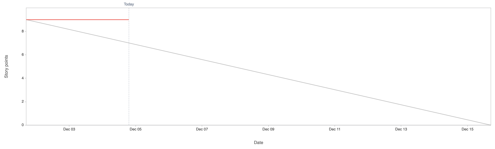
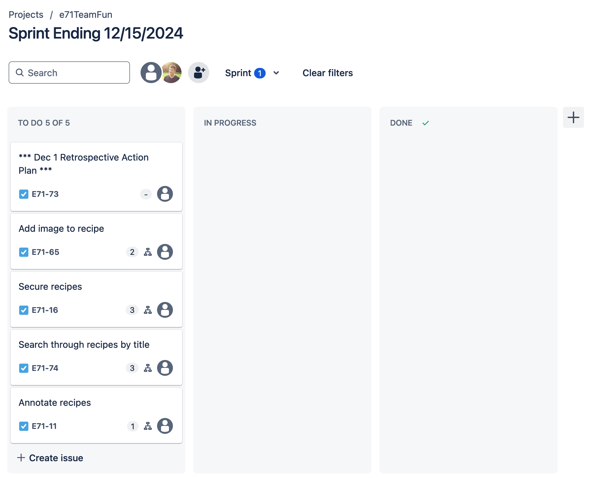

Attendees: Danny, Andrew, Veronika, Mark, Karun

Recapped work from last working session.

Sprint burndown chart so far (at the beginning of today's scrum):

Kanban board (at the beginning of today's scrum):

Research Review:
* We can include images, or URLs to images as part of a model (e.g. recipe)
* Libraries like pillow allow for image resizing to generate appropriate thumbnails
* Django file upload location is configurable, e.g. S3 or digitalocean
* Helpful image links
  * [This repo](https://github.com/jazzband/sorl-thumbnail) is potentially helpful to handle images in Django
  * [This tutorial](https://learndjango.com/tutorials/django-file-and-image-uploads-tutorial) provides general guidance
  * [The documentation](https://django-storages.readthedocs.io/en/latest/) on Django storage
* Helpful authenticaiton links
  * [This quickstart guide](https://auth0.com/docs/quickstart/webapp/django/01-login) on using Auth0 with Django

Impediments:
* Review of rubric
* Not being sure where images should be stored to be accessible to remotely deployed Django (we have options)

Done:
* We can now add an image when we add a recipe locally
* We can see images added to a recipe when viewing that recipe locally
* We can see images added to a recipe when browsing all recipes locally

TODO:
* Test all image functions when hosted remotely
* Allow deletion of images via the edit recipe functionality
* Use POST request to delete objects
* Rename references to "add" recipe to "add or edit" recipe
* More specific users in user stories

