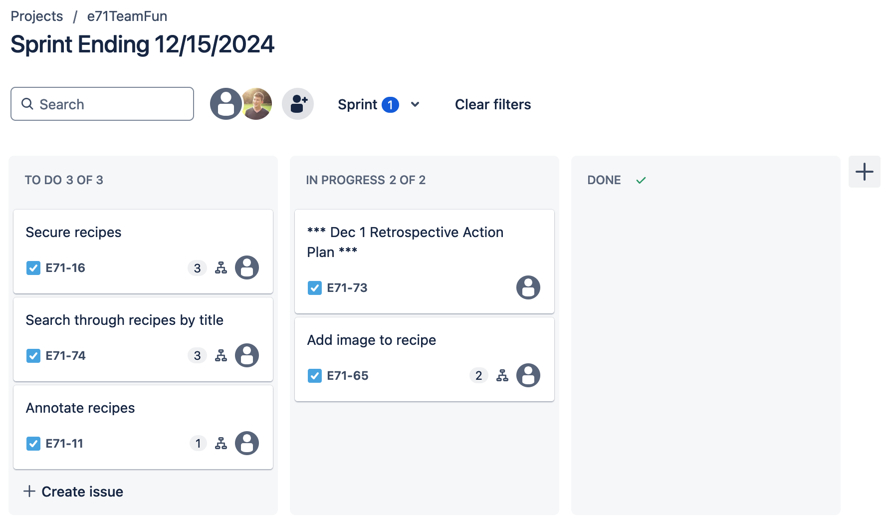

Attendees: Danny, Andrew, Veronika, Mark, Karun

Recapped work from last working session.

Sprint burndown chart so far (at the beginning of today's scrum):

Kanban board (at the beginning of today's scrum):

Impediments:
* Review of rubric
* Not being sure where images should be stored to be accessible to remotely deployed Django (we have options)

Done:
* Tested image functions when hosted remotely
* Allowed deletion of images via edit recipe functionality
* Introduced first BDD test

TODO:
* Introduce additional tests
* Allow for user security
* Use POST request to delete objects
* Rename references to "add" recipe to "add or edit" recipe
* More specific users in user stories
