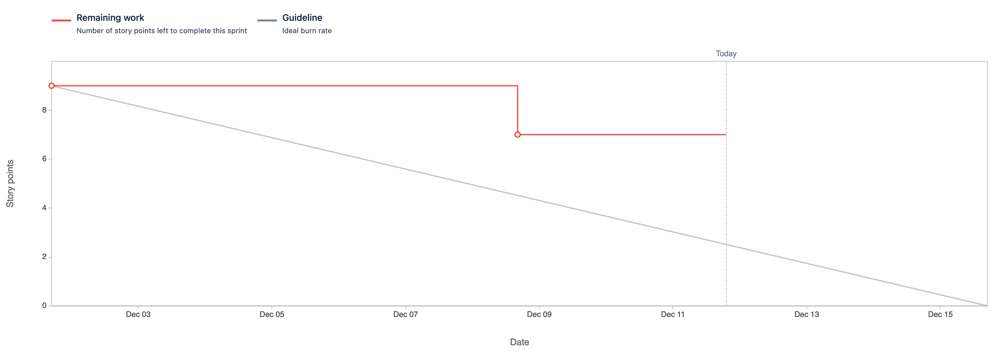
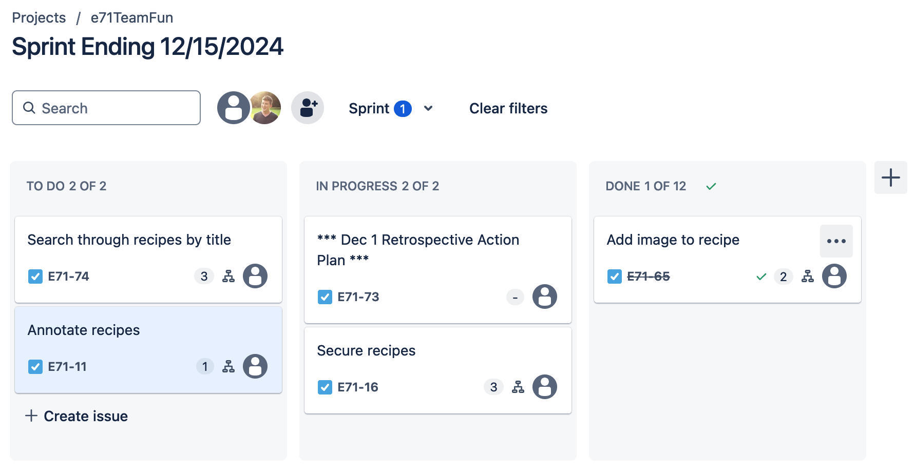

Attendees: Andrew, Veronika, Mark, Karun

Recapped work from last working session.

Sprint burndown chart so far (at the beginning of today's scrum):

Kanban board (at the beginning of today's scrum):

Impediments:
* Review of rubric

Done:
* Refactored code to remove image to accessory function
* Added testing

TODO:
* Introduce additional tests
* Allow for user security
* Use POST request to delete objects
* Rename references to "add" recipe to "add or edit" recipe
* More specific users in user stories
