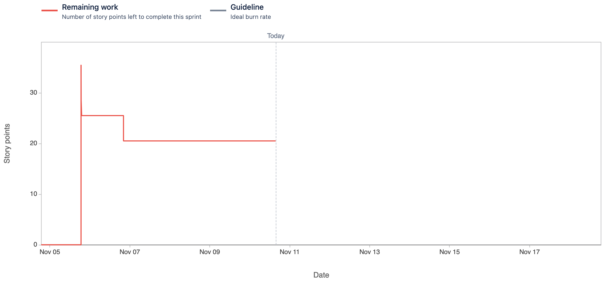

Attendees: Karun, Mark, Andrew, Veronika

Recapped work from last working session.  We worked as a group on Wednesday, and we're not sure what to document in terms of individual efforts

Sprint burndown chart so far:

Impediments:
* Some issues with technology / meeting links (thankfully resolved)
* Reminder: Next sprint starts 11/18.  Stakeholder meeting scheduled for 11/17
* Reminder: Forecast may be incorrect (we had limited data to predict velocity)
* Using dynamic forms [seems possible but hard](https://stackoverflow.com/a/6142749) - let's stick with what we've got for now
* Is having the ability to do smaller meetings helpful?  E.g. having pairs working outside the Wednesday/Sunday
  * We'll continue as-is for today and the following Wednesday, but may meet again between Wednesday and next Sunday to meet assignment requirements (not add features)
* Review of rubric