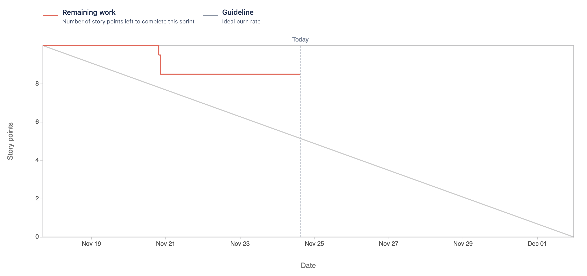
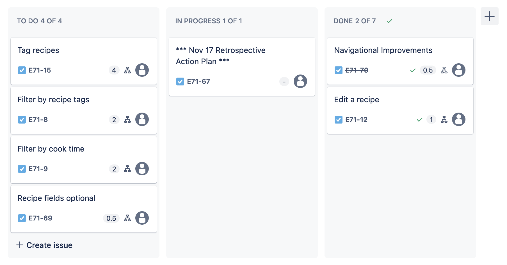

Attendees: Danny, Mark, Andrew, Veronika, Karun

Recapped work from last working session.

Sprint burndown chart so far (at the beginning of today's scrum):

Kanban board (at the beginning of today's scrum):

Impediments:
* Review of rubric
* Possible "Code smell" issues

Ideas:
* Mark found a [great resource](https://dev.to/thedevtimeline/how-to-add-tags-to-your-models-in-django-django-packages-series-1-3704) 
to help put tags on recipes

Done:
* We've edited the Recipe model and the add/edit recipe form to allow for adding
custom tags to recipes

TODO:
* The new edit page requires all fields to be populated, and creates a new recipe 
(rather than overwriting an existing recipe)
* Prepare for stakeholder meeting on 12/1 (Confirm date!)
* Have a total of 20 unit tests by end of sprint
* Use POST request to delete objects
* Rename references to "add" recipe to "add or edit" recipe
* Refactor some functionality for easier unit tests.  E.g. rather than embedding the functionality to edit a recipe
inside a view, build a utility method for overwriting an exiting recipe that we could also write a unit test for.  Call
that utility method from both the view and the unit test
* Add a "Clean recipe data" from a form, and use this as a constructor.  This can also be unit tested
* "Code smell" issues can be an impediment