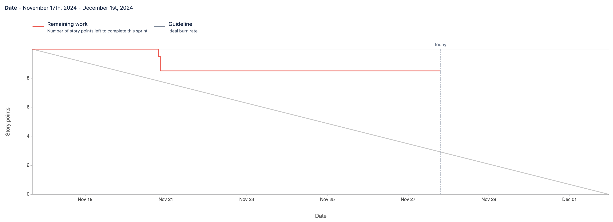
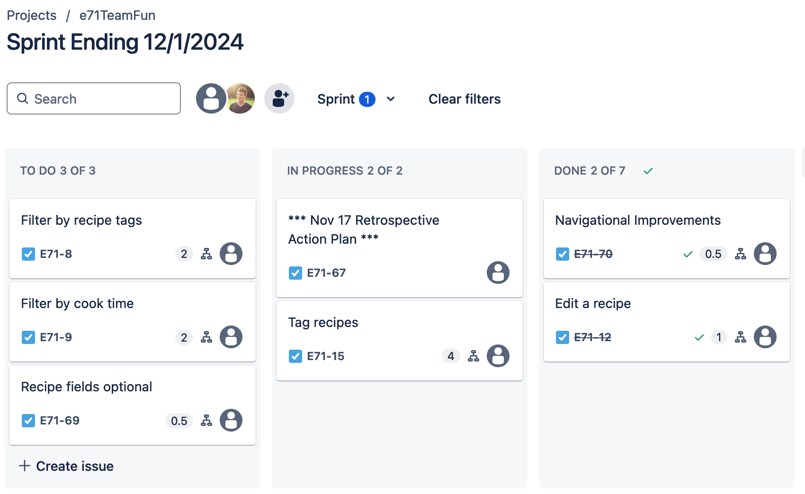

Attendees: Danny, Andrew, Veronika, Mark

Recapped work from last working session.

Sprint burndown chart so far (at the beginning of today's scrum):

Kanban board (at the beginning of today's scrum):

Impediments:
* Review of rubric
* Possible "Code smell" issues
* Prepare for stakeholder review at 3PM Eastern on 12/1

Done:
* Reached 20 unit tests
* Added filter functionality by a single tag

TODO:
* Use POST request to delete objects
* Rename references to "add" recipe to "add or edit" recipe
* Refactor some functionality for easier unit tests.  E.g. rather than embedding the functionality to edit a recipe
inside a view, build a utility method for overwriting an exiting recipe that we could also write a unit test for.  Call
that utility method from both the view and the unit test
* Add a "Clean recipe data" from a form, and use this as a constructor.  This can also be unit tested
* More specific users in user stories